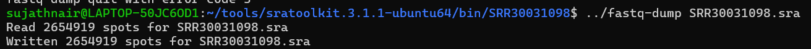
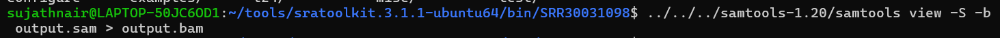

# NGS-Variant Calling

NGS variant calling is a computational process that identifies differences between a reference genome and an individual or a population of individuals. It is the first step in the NGS data analysis pipeline. Variant calling can help find out Single Nucleotide Polymorphisms(SNP),Insertions,Deletions(INDELS), Copy Number Vaariations(CNV)
Variant Calling is important because it provides insights into the gentetic variation that causes phenotypic differences between individuals and populations.

## Tools Required

1. SRA Toolkit
2. FastQC
3. Trimmomatic
4. BWA or Burrows Wheeler Aligner
5. SAMtools or Sequence Alignment Mapping tools
6. GATK(Genome Analysis Tool Kit)
           

Make sure that the versions are the latest available versions at the time. I will provide links to download the tools at the end of the article.
     While I was doing my NGS project, I made a mistake by downloading the wrong version of sratoolkit. That particular version had an issue with the prefetch command. I had to remove the sratoolkit,I had downlaoded and download it again. So make sure you download the latest version from the NCBI website or the official websites of the tool developers   

## Downloading Reference Genome

  You should have a reference genome to proceed with the variant calling.So let's see the process of downloding a reference genome. Go to the NCBI website select SRA database and your preferred organism and select any SRR number of your choice. 

  

  You will reach this page

  

  In the above screenshot you can see a heading 'Sample' and below it you can find 'Organism : Mycobacterium tuberculosis'. Click on the name of the organism and it will take you to another page. There you can see a black menu bar on the top.On it there is a 'Genome' button.

You will reach this page.

Mostly you will have to give the name of your chosen organism again on the search bar to load this page with the list. Click on the organism name under the 'Scientific name' coloumn. You will be taken to another page

 Scroll down to the bottom of the page and you will see a download button.Click on the download button and you will see a list with checkboxes. Select the following and click download at the bottom of the page.You may have to scroll a little more to reach the bottom.That is why the download is not seen in my screeshot.

 

 Thus you have your reference genome.

## Process Workflow

First step is to select an organism you desire to work with. It can be any organism of your choice. I have chosen Mycobacterium tuberculosis,the bacterium which causes TB.Then you need to find a sample genome for the organism. There are many sample genomes available for the same organism in the NCBI website's SRA database

You can select any sample from the numerous samples shown. Click on any one of the samples. when you go inside,you will see what's called an SRR number

This is the SRR number I used for my project,so I showed the same here.You are free to choose any other sample data and therefore a different SRR number. Copy the SRR number  and using terminal download the SRA file. I did all my following terminal operations in ubuntu for windows. 

 I had forgotten to take the screenshot of the prefetch command during my project. So for attaching here,I used another SRR number to download SRA file and took a screenshot.
You will notice a folder created in the name of the SRR number and when you go inside the folder you will find an SRA file created. Now,you cannot work with an SRA file. So it should be converted to a FASTQ file. You can do it through the sratoolkit itself. 

Here we got only one fastq file. Most samples have paired reads i.e there will be sequences of both the strands of the DNA,5'-3' and 3'-5'. So we can split the fastq file into 2. 

--split-3 actually creates two fastq files. A third file if generated will be of low quality and can be eliminated. For me only two files were generated,SRR30031098_1 and SRR30031098_2. The two files which are created will be of only high quality reads. 
Then you need to generate a FastQC report using FastQC tool. You don't need to use terminal to run FastQC tool. You can directly give the fastq file,one at a time,via the GUI. Once the FastQC report is generated,you can decide about trimming.If your FastQC report is good without yellow peaks below the faint red line and most other parameters are good with green tick marks,you can probably skip trimming. Usually when the fastq sequences are trimmed,it trims whatever comes below the faint red line on the yellow bars. For me there were no peaks on the yellow bars below the red line, the adaptor sequence content graph also had no peaks and was a line parallel to x-axis,close to the x axis. So I had skipped the trimming step. 
Once the trimming is finished or you decide against trimming, you can move on to the next step which is Sequence Alignment Mapping. 
Sequence Alignment Map(SAM) is a text-based format for storing biological sequences aligned to a reference sequence. This method was developed by Heng Li and Bob Handsaker et al. Once you finish Sequence Alignment mapping,you will have a sam file as result. A sam file is created using a BWA tool or  a Burrows Wheeler Aligner. BWA is made up of 3 algorithms,which are:-

BWA-backtrack
For sequence reads upto 100bp

BWA-SW
For longer sequences from 70bp to 1Mbp

BWA-MEM
For high quality queries as it is faster and more accurate

Before running BWA you need to take care of a few things. 
1) You should have the reference genome and sample genome stored in working directory.
2) The reference genome should be unzipped and saved.
3) We should run indexing command first

The indexing command is 

If we don't run an indexing command,it will throw an error .The BWA command for alignment would be

This command would be fine if you are using BCFTools.But if you are using GATK,this command would not be sufficient. GATK requires headers and IDs for the sam file.Else when you try to convert the sam file to bam file GATK will throw an error,'headers not found'. I have added the GATK shell scripting commands as a separate file.
Next step is to convert the sam file to a bam file using Samtools. The linux command would be 

After creating a bam file,we need to sort it. Sorted BAM file has data sorted by chromosomes,contigs etc  with respect to the reference genome.Its easier to access sorted data.Sorted data is slightly more compact and helps to remove low quality reads. Here is the linux command

Once you have the sorted bam file you can head to variant calling. If you are using BCF tools, you can execute the following commands and perform variant calling

   `bcftools mpileup  -o  b -o  result.bcf  -f  GCF_000195955.2_ASM19595v2_genomic.fna  --threads 8  -q  20  -Q  30 output.sorted.bam`
                
   This command performs a pileup.
   Now you can perform variant calling using the next command

 `bcftools call  --ploidy 1  -m  -v  -o  variants.raw.vcf  result.bcf`

 You can give ls command and see if the vcf file has been created.Next you need to perform filtering.Since I performed the remaining operations on GATK,I am not  giving the steps to perform filtering in linux terminal               
As I said, after creating sorted bam file, I took a detour and switched to GATK and shell scripting. I had to create my sam file once again because GATK does not accept sam files without headers and IDs. After redoing that particular step and creating another sam file and replacing my old sam file with the new one,I performed the De-Duplication function to remove duplicates from the bam file.
Then you can proceed to the variant calling step. You then get a vcf file as the output. Now you can go further and clean the data. Hence you can separate the variants as SNPs(Single Nucleotide Polymorphism) and INDELS(Insertions and Deletions).
Then you apply filters to the variants. They are the following:-

1. QD(QualByDepth)- This is the variant's QUAL score normalized by the allele depth.QD normalises the variant quality to avoid inflation caused by deep coverage. Typical value for this filter is 2.0 and variants below this value can be filtered out.
2. FS(Fisher Strand)-It measures the preference of one strand over the other. This filter excludes variants with a high FS value to remove false positives. Typical value is FS>60, even >50 is fine
3. DP(Total Depth)-  The filtered depth or the number of filtered reads that support a reported allele. Typical value is <8. 
4. SOR(Strand Odds Ratio)-This is a statistical test used in GATK to filter out potential false positives. Typical value can be >3
5. MQ(Mapping Quality)-Root mean Square mapping quality value that measures the quality of mapping over all reads at a site. MQ < 40 can be filtered out.
6. GQ(Genotype Quality)-Used to identify and remove low quality variants. GQ < 20 is a typical value.

Once you filter the variants we can separate the variants which have passed the filters. Remember,now you have two vcf files;one for SNPs and one for INDELS. So applying filters and separating the filter passed variants have to be done separately for each one.  Finally,if you wish to,you can merge the filter passed SNPs and INDELS into one vcf file.

## Antibiotic Resistance prediction using Mykrobe

  Mykrobe is a tool which can predict antibiotic resistance. Mykrobe accepts FASTA,FASTQ,sam,bam files as inputs. So at any point in this variant calling,you can use Mykrobe for antibiotic resistance prediction,which I had done during my NGS variant calling. I used bam file as input and the output can be saved as screenshot. JSON file can be difficult to read when opened in MS word or Notepad.

​	

## Links
NCBI website
https://www.ncbi.nlm.nih.gov/

SRA toolkit
https://www.ncbi.nlm.nih.gov/home/tools/

FASTQC-Babraham Bioinformatics
https://www.bioinformatics.babraham.ac.uk/projects/fastqc/

FASTQC-SourceForge
https://sourceforge.net/projects/fastqc.mirror/

Trimmomatic
https://github.com/usadellab/Trimmomatic/releases

BWA-website
https://bio-bwa.sourceforge.net/

BWA-GITHUB
https://github.com/lh3/bwa

BWA-SourceForge
https://sourceforge.net/projects/bio-bwa/

SAM Tool
https://www.htslib.org/download/

GATK
https://gatk.broadinstitute.org/hc/en-us

Mykrobe
https://www.mykrobe.com/

 
